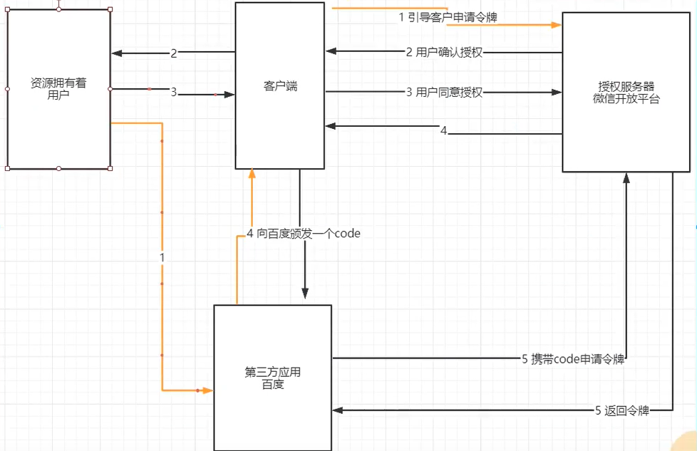
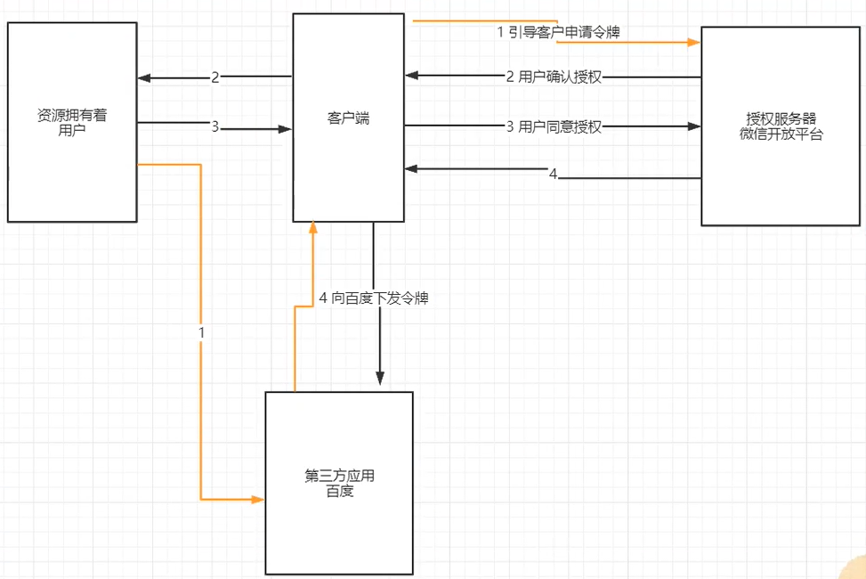
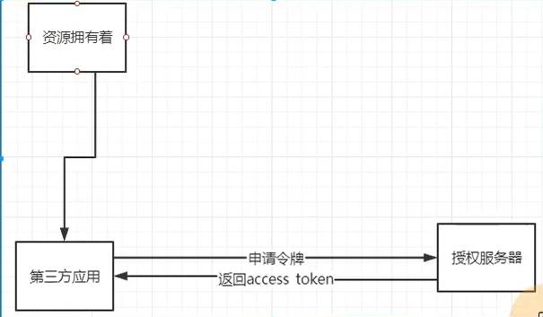
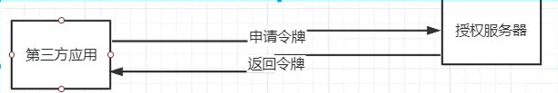

## OAuth2.0 协议
OAuth2.0 是一个开放标准，允许用户授权第三方应用程序访问他们存储在另外的服务提供者上的信息，
而不需要将用户名和密码提供给第三方应用或分享他们数据的所有内容。  
OAuth2.0 协议的认证流程，简单理解就是允许我们将之前的授权和认证过程交给一个独立的第三方进行担保。
## OAuth2.0 协议有哪几种认证方式?
1. 授权码模式：用户、第三方服务、授权服务器均不互信，所以要先验证授权信息，然后给出令牌，最后还验证令牌。

2. 简化模式：用户、第三方服务不互信，第三方和授权服务器互信，所以只需验证授权信息，然后给出令牌。

3. 密码模式：用户、授权服务器不互信，用户和第三方服务互信，所以直接给出授权信息，由第三方服务去申请令牌。

4. 客户端模式：用户、第三方服务、授权服务器互信，所以无需验证授权信息，直接给出令牌。

## 什么是 JWT 令牌？和普通令牌有什么区别？
