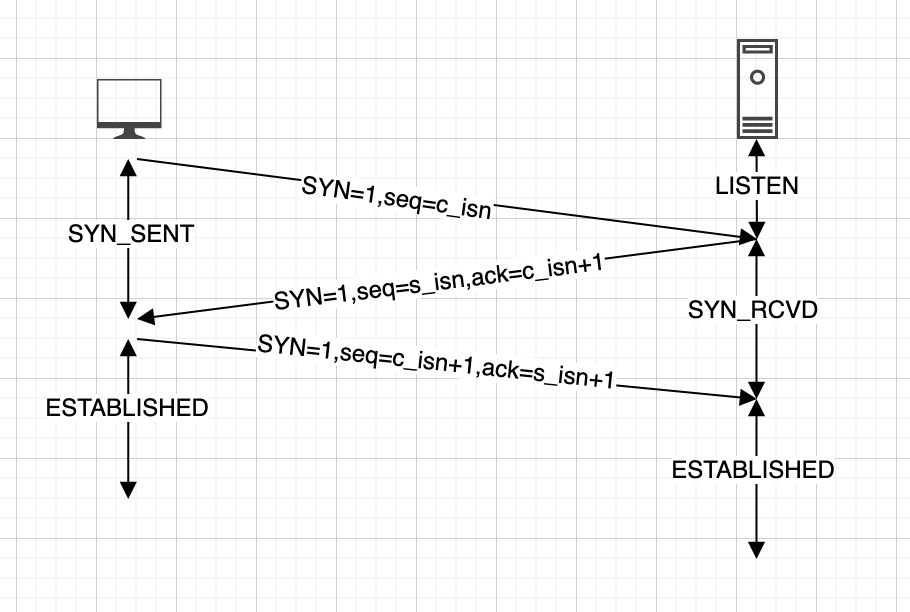
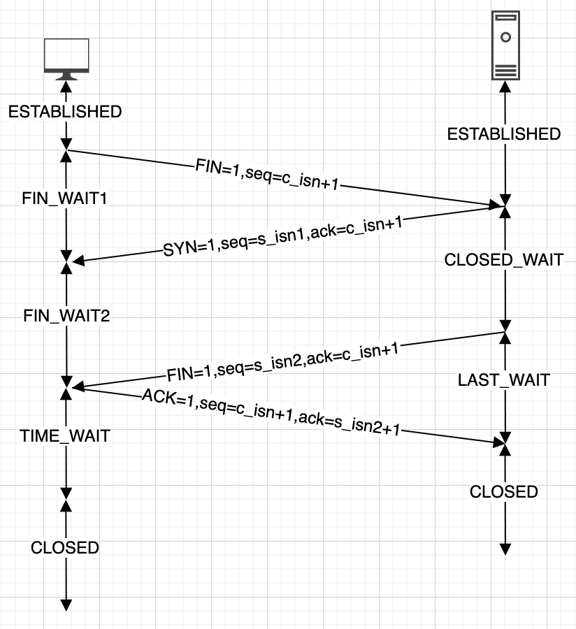

# TCP/IP基础知识
## 三次握手
TCP 协议是 7 层网络协议中的传输层协议，负责数据的可靠传输。  
在建立 TCP 连接时，需要通过三次握手来建立，过程是：
1. 客户端向服务端发送一个 SYN
2. 服务端接收到 SYN 后，给客户端发送一个 SYN_ACK
3. 客户端接收到 SYN_ACK 后，再给服务端发送一个 ACK

## 四次挥手
在断开 TCP 连接时，需要通过四次挥手来断开，过程是：
1. 客户端向服务端发送 FIN
2. 服务端接收 FIN 后，向客户端发送 ACK，表示我接收到了断开连接的请求，客户端你可以不发数据了，不过服务端这边可能还有数据正在处理
3. 服务端处理完所有数据后，向客户端发送 FIN，表示服务端现在可以断开连接
4. 客户端收到服务端的 FIN，向服务端发送 ACK，表示客户端也会断开连接了

## 拥塞控制
### 慢启动
### 拥塞避免
### 快重传
### 快恢复
