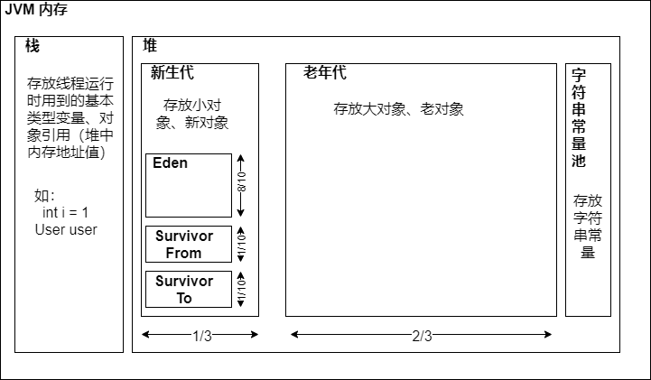
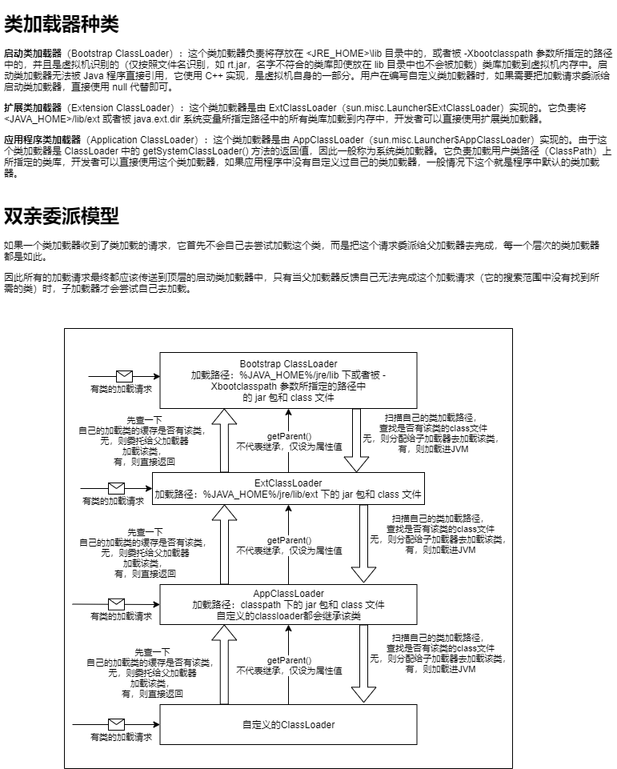
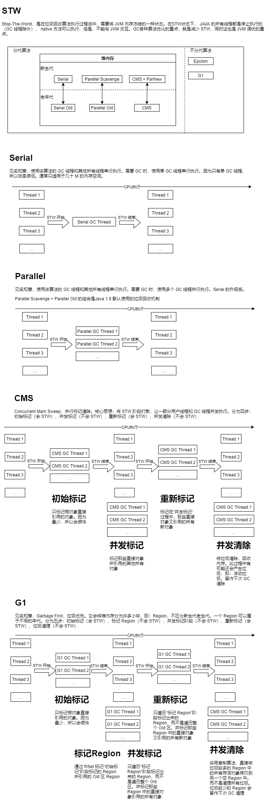
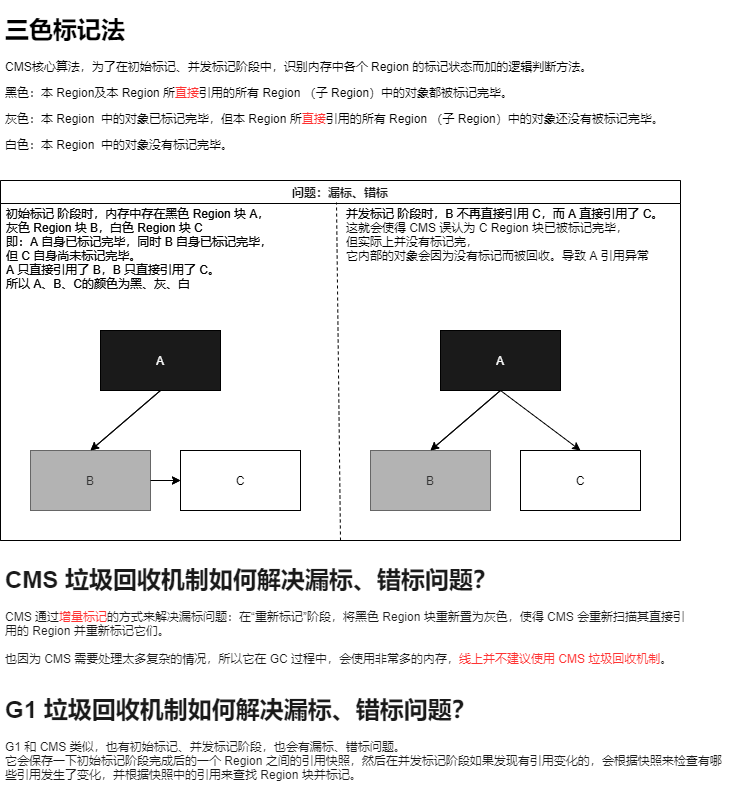
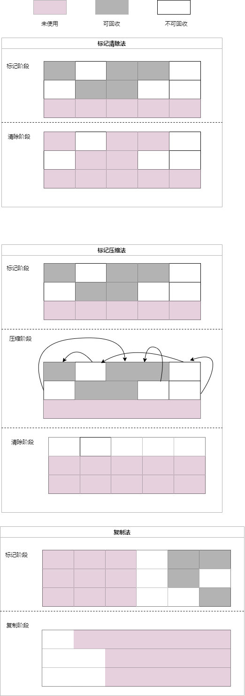

# JVM 
## 内存模型

## class加载机制

## 垃圾回收机制（垃圾回收器）

## 垃圾回收算法
**引用计数法（Java 没有采用、Python 采用）**  
每个对象有一个引用计数属性，新增一个引用时计数加 1，引用释放时计数减 1，计数为 0 时可以回收。  
此方法简单，但无法解决对象循环引用和内存碎片的问题。 

**标记清除法（Mark Sweep）：**  
先找到一些 GC Root 根节点，将其标志位置为 1，即不可回收（从栈帧里找，方法中的局部变量、引用类型参数、引用类型静态变量、引用类型常量、String常量池中的引用、所有当前被加载的 java 类等）  
然后根据这些根节点去找它们引用的其他对象，将其标志位置为 1，即不可回收  
最后没有和根节点存在引用关系的对象，其标志位会被置为 0，即可回收，但此时不会直接回收。    
而是在该对象被第二次依然标记为 0 时，才会进行回收。  
存在内存碎片问题。如要分配大对象时，可能此时垃圾并不多，  
但因一直没有连续的大内存空间，JVM 会试图通过 GC 来清理出连续内存空间，导致频繁 GC。

**标记压缩法（Mark Compact）：**  
堆内存老年代会用该算法  
先找到一些 GC Root 根节点，将其标志位置为 1，即不可回收（从栈帧里找，方法中的局部变量、引用类型参数、引用类型静态变量、引用类型常量、String常量池中的引用、所有当前被加载的 java 类等）  
然后根据这些根节点去找它们引用的其他对象，将其标志位置为 1，即不可回收  
将这些标志位为 1 的对象，一个一个挪到连续的内存空间中  
直接清理该连续内存边界外的其他内存空间。  

**复制算法（Coping）：**  
堆内存新生代会用该算法  
将内存分为两半，每次只使用其中一半，每次 GC 会将使用中的内存中的不可回收对象直接拷贝到另外一半中，然后直接回收当前这一半内存。
存在浪费内存空间、效率和存活对象的个数有关的问题
  
## 锁原理
## JVM 调优
通过定制 JVM 运行参数来提高 JAVA 应用程序运行效率。
参数种类大致可分为三类：  
标准参数：- 开头的参数，所有 JDK 版本都支持。可以用 `java -help` 打印出来。文档很全  
非标准参数：-X 开头，和特定 JDK 版本有关。可以用 `java -X` 打印出来。文档比较全  
不稳定参数：-XX 开头，和特定 JDK 版本有关，并且变化非常大，可以用 `java -XX:+PrintCommandLineFlags -version` 打印出来。详细文档资料很少

关于不稳定参数的查看方式：  
`java -XX:+PrintCommandLineFlags -version`：打印当前 JDK 版本可用的不稳定指令  
`java -XX:+PrintFlagsInitial -version`：打印当前 JDK 版本所有的不稳定指令的默认值  
`java -XX:+PrintFlagsFinal -version`：打印当前 JDK 版本所有的不稳定指令的最终生效值  

可以看到不稳定参数中有大量 CMS 相关的参数，侧面反映了 CMS 垃圾回收机制其实很难用，要它发挥最大效率并不容易。算法并不稳定  
官方也并不建议线上使用 CMS。甚至 CMS 默认是关闭的。Serial 默认也是关闭的。Parallel 默认是开启的  

java 进程监视器：  
1、%JAVA_HOME%/bin 下的 jvisualVm.exe 可提供图形化监控界面  
2、arthas，  
arthas 常用指令：  
dashboard：可查看内存使用情况、线程情况、运行环境。  
thread：可查看线程详情。-b 可直接查看发生死锁的线程  

_可以看看开源项目的启动脚本，学习它们是选用哪些参数，如何调优的。_  
