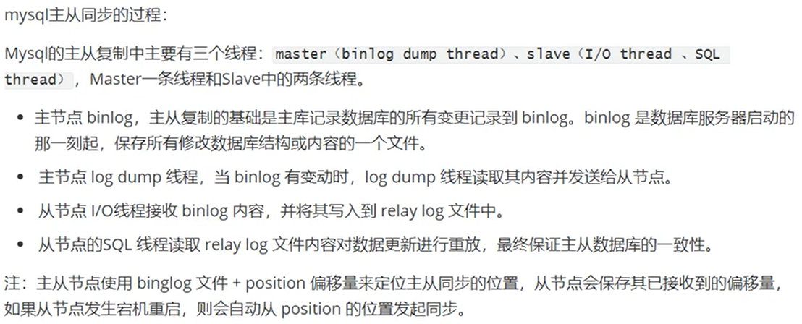
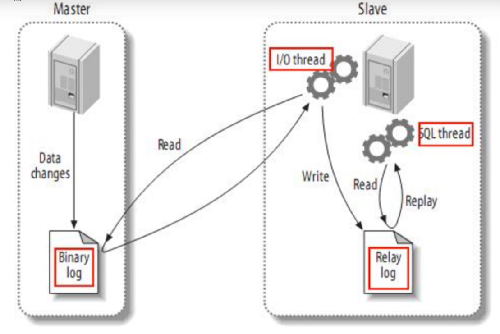
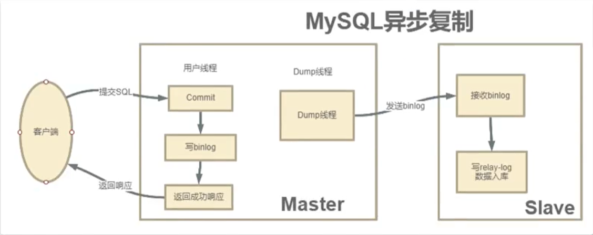
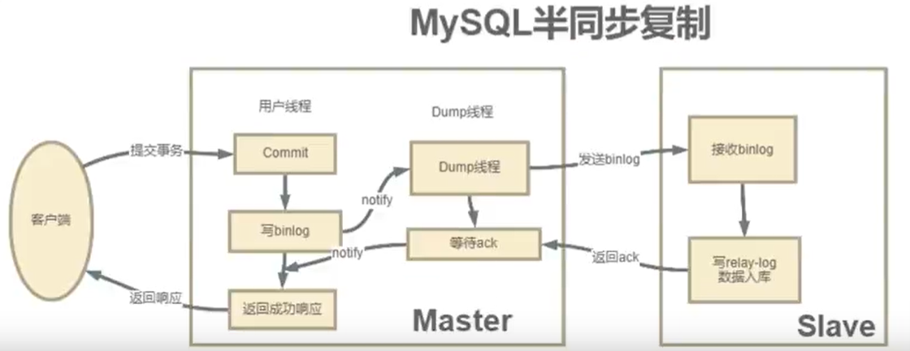
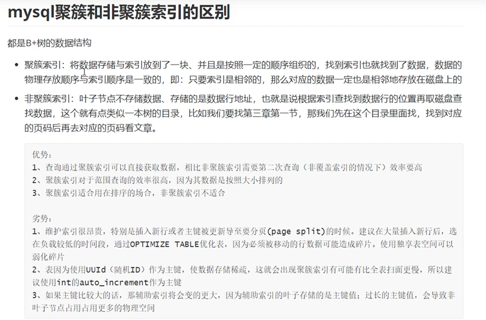
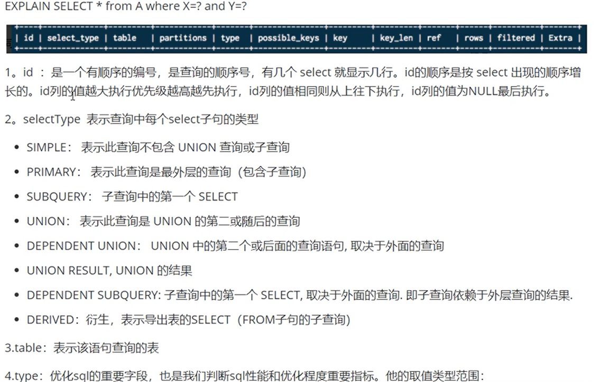
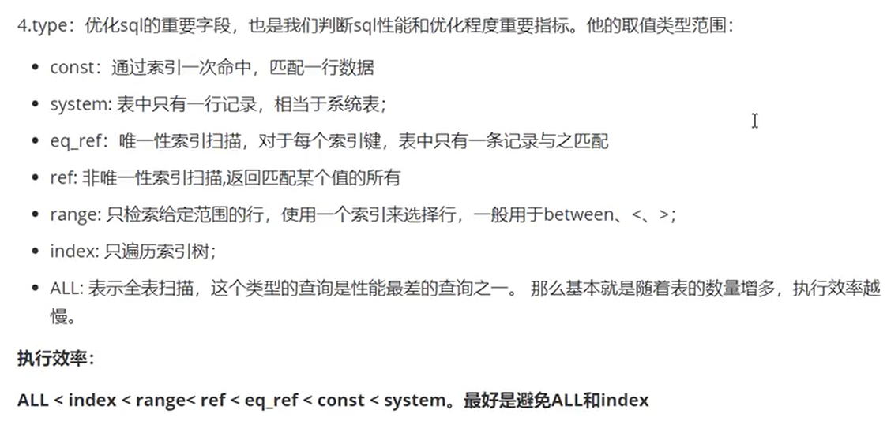
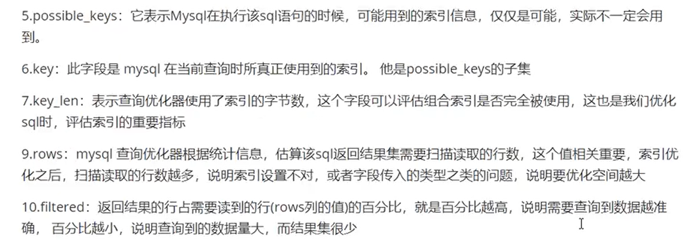
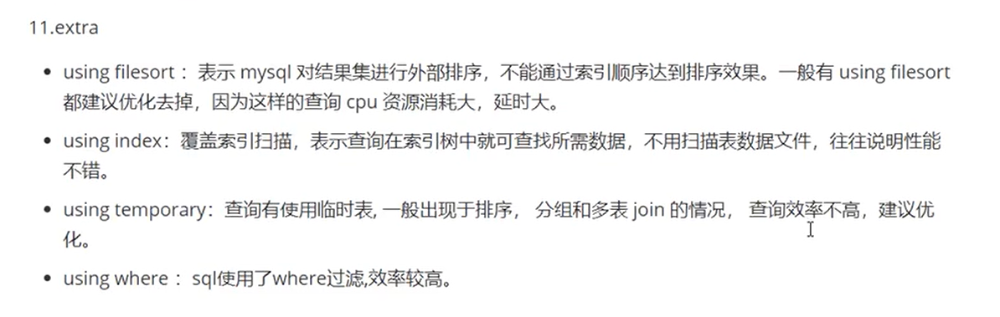

# MySql

## B 树和 B+ 树
B 树：  
1. 节点排序
2. 一个节点可以存放多个元素，并且这些元素也是有序的

B+ 树：
1. 拥有 B 树的特点
2. 叶子节点之间有指针。（不仅仅是父子节点之间有引用，叶子节点之间也存在引用）
3. 叶子节点存储了所有的元素，并且是有序的。

MySQL 索引使用的 B+ 树，一个 InnoDB 页就是一个 B+ 树节点，页大小默认 16K。
而一个节点可以存放多条记录（也就是一个 InnoDB 页可以存放多条记录），一般情况下两层的 B+ 树可以存放 2000W 条数据。  
而因为叶子节点之间有指针，所有元素均在叶子节点上，且元素有序，所以对于全表扫描、模糊查询、范围查找等操作支持较好。

## MySQL 主从一致
其实就是从机会将主机的 bin log 里的 SQL 拿过来，执行一遍


MySQL 通过将主节点的 Bin log 同步给从节点完成主从之间的数据同步。
MySQL 的主从集群只会将 bin log 从主节点同步到从节点，而不会反过来同步。
由此也就引申出了读写分离的问题。因为要保证主从之间的数据一致，写数据的操作只能在主节点完成，而读数据可以在主、从节点上完成。
读写分离需要业务系统自己实现，也就是增删改数据使用主节点数据源，查数据可以任意。
### 异步复制
MySQL 主从集群默认采用的是一种异步复制的机制。主服务在执行用户提交的事务后，写入 binlog 日志，然后就给客户端返回成功。
而 binlog 会由一个 dump 线程异步发送给 Slave 从服务。  
由于发送 binlog 的过程是异步的。主服务在向客户端反馈执行结果时，是不知道 binlog 是否同步成功了的。
这时候如果主服务宕机了，而从服务还没有备份到新执行的 binlog，那就有可能会丢数据。

### 半同步复制机制
半同步复制机制是一种介于异步复制和全同步复制之前的机制。
主库在执行完客户端提交的事务后，并不是立即返回客户端响应，而是等待至少一个从库接收并写到 relay log 中，
（注意这里从库还没有将数据真正写入磁盘，此过程可能较慢）才会返回给客户端。
MySQL 在等待确认时，默认会等 10 秒，如果超过 10 秒没有收到 ack，就会降级成为异步复制。  
这种半同步复制相比异步复制，能够有效的提高数据的安全性。
但是这种安全性也不是绝对的，它只保证事务提交后的 binlog 至少传输到了一个从库，并且并不保证从库应用这个事务的 binlog 是成功的。
另一方面，半同步复制机制也会造成一定程度的延迟，这个延识时间最少是一个 TCP/IP 请求往返的时间。

### 全同步复制机制
主库写入 binlog 后强制同步日志到从库，所有的从库都执行完成后才返回给客户端，但是很显然这个方式的话性能会受到严重影响。
### Bin Log 善用
可以看到只要拿到 MySQL 的 Bin Log 文件，就等于拿到了 MySQl 中的数据。
那么我们其实可以将 Bin Log 解析并发送给 Redis、Kafka 等其他需要用到数据的组件。
以避免在业务代码中，插了 MySQL，还要去插 Redis，还得发 Kafka。或者反复查 MySQL 以刷新缓存造成 MySQL 压力过大。

## MySql引擎
### mysql支持的引擎及特性
#### MyISAM 引擎
表级加锁。读取时，在表上获取共享锁（读锁）；写入时，在表上获取排他锁（写锁）。  
索引文件与数据文件单独存放，使用非聚集索引；支持延迟更新索引；支持自动修复索引和手工修复索引。
当使用表创建选项`DELAY_KEY_WRITE`创建的 MyISAM 表，在插入和修改之后不是将索引的改变写入磁盘，
而是写入内存的键缓冲区中缓存索引的改变数据。只有在清理缓冲区和关闭表时，才将索引写入磁盘。
如果服务器中间崩溃，索引将损坏，需要修复。  
MyISAM 引擎只使用非聚集索引，它的主键索引和辅助索引均为非聚集索引，只是存储的内容不同。
主键索引的节点存主键值，辅助索引的节点则存储辅助键值。它们的叶子节点都存放数据的地址值。
同时，访问辅助索引不需要再次访问主键索引。  
因此，如果涉及到大数据量的排序、全表扫描、count（不带 Where 条件的） 之类的操作的话，还是 MyISAM 占优势，因为索引所占空间小，这些操作是需要在内存中完成的。
#### InnoDB 引擎
支持 4 种隔离级别，行级锁，所有索引包含主键，主键索引是聚集索引。辅助索引则为非聚簇索引。  
InnoDB 中，一定是有主键的，如果表明确定义了 PK，那 PK 就是聚簇索引。
如果没有 PK，就会找第一个非空的 unique 列作为聚簇索引。
否则，InnoDB 会创建一个隐藏的 row-id 作为聚簇索引。  
而辅助索引则是建立在主键索引之上的，它的叶子节点保存的并不是数据，而是 PK。
因此辅助索引访问数据总是要进行二次查找，第一次找到辅助索引上记录的 PK，第二次去主键索引上通过 PK 找数据。

## 事务四大特性
ACID：  
A：原子性，由 InnoDB 的 undo log 文件保证，它记录了需要回滚的日志信息，事务回滚时撤销已经执行成功的 SQL  
C：一致性，由其他三类特性保证  
I：隔离性，由 MVCC 多版本控制来保证  
D：持久性，由内存 + InnoDB 的 redo log 文件保证，mysql 修改数据会同时会在内存和 redo log 记录这次操作，宕机时可以从 redo log 文件恢复

## MySql索引
### 树的进化
二叉树 ->  AVL 树 ->  红黑树 ->  B-(B) 树 ->  B+ 树
1. 二叉树：每个节点最多只有两个子节点，且左边的子节点会比当前节点小，右边的子节点会比当前节点大  
会有数据不平衡问题，使得树的左右高度相差过大，导致检索缓慢  
2. 二叉平衡树（AVL 树）：在二叉树基础上，还会约束任意节点的两个子树的高度差最大为 1。（有平衡算法，将子树旋转实现平衡）  
3. 红黑树：  
每个节点都有颜色，红色或黑色。   
根节点必须为黑色。每个叶子节点都是黑色的空节点。  
红色节点的父、子节点都必须为黑色。  
从任意节点到其每个叶子节点的所有路径都包含相同的黑色节点  
4. B-(B) 树：  
每个非叶子节点的子节点个数都不会超过D（D 即为 B- 树的阶）  
所有叶子节点都在同一层  
所有节点关键字都按递增顺序排列  
5. B+ 树：  
非叶子节点并不存储数据，只做数据索引  
所有数据都存在叶子节点中  
每个叶子节点都有相邻叶子节点的指针（引用）  
叶子节点按照本身关键字从小到大排序  
### 实现索引的数据结构划分

B-Tree索引
> 每个叶子节点到根节点的距离是一样的，它的每一个叶子节点都包含了指向下一个节点的联接，以实现快速的范围遍历（实际上是B+Tree）。
>   
>  由于B-Tree是按照一定的次序组织索引，因此B-Tree索引能很好的用于全键值、键值范围或键前缀查找（最左前缀）。
> 

Hash索引
> 建立在hash表的基础之上。键是存储引擎计算出的被索引列的hash码，值是指向对应行的指针。 如果有多个行hash到一个槽位，索引就会把行指针以链表的方式保存。
> 
> 对索引中的每一列精确值查找有效
> 

空间索引（R-Tree）
> R树是空间数据索引结构中重要的一种层次结构，目前已成为许多空间索引方法的基础，不少前沿的空间索引都适用到R树或者对R树的改良。其构建思想是以最小边界矩形（MBR）递归对空间数据集的空间按照"面积"规划进行划分。它的铁电如下
> 
> 1、R树中非叶子节点代表一个划分的空间区域，即一个矩形空间区域；
> 
> 2、R树中的叶子节点包含的矩形区域对应空间对象的MBR。 
> 
> 必须使用MySql GIS函数查找生效。

全文索引
>  FULLTEXT 是一种特殊的索引。用于全文查找，使用倒排索引实现，本质上是一种特殊的两层结构的B树。


### 表内索引主次划分
主索引
> 使用primary key指定的索引列

辅助索引
> 使用key指定的索引列

### 表内索引与数据存放的维度划分
聚集索引
> 索引和数据一起存放，查找数据时不需要取对应的数据行。如果不是索引键顺序插入，会导致大量数据移动，分页变稀疏，进而导致碎片。  
> 因为聚簇索引的数据物理存放顺序和索引顺序一致，所以一张表只能有一个聚簇索引。而非聚簇索引可以有多个。

非聚集索引
> 索引和数据分开存放。叶子节点保存的引用的主键列，需要两次索引查找。

InnoDB的主索引是B-Tree索引，同时也是聚集索引，树的叶子节点上的 data 中存放的是数据本身。辅助索引是非聚集索引。  
MyISAM主索引和辅助索引都是非聚集索引。树的子节点上的 data 中存放的是数据存放的地址，不是数据本身。  


## MySql 锁
### 粒度上划分
1. 行锁：加锁粒度小，但是加锁资源开销比较大。InnoDB 支持。
   1. 共享锁：读锁。多个事务可以对同一个数据共享同一把锁。持有锁的事务都可以访问数据，但是只能读不能修改。
   要使用共享锁，需要加关键字：SELECT xxx FROM xxx LOCK IN SHARE MODE;
   2. 排他锁：写锁。只有一个事务能够获得排他锁，其他事务都不能获取该行的锁。InnoDB 会对 update、delete、insert 语句自动添加排他锁。 
   3. 自增锁：通常是针对 MySQL 当中的自增字段。如果有事务回滚这种情况，数据会回滚，但是自增序列不会回滚。
2. 表锁：加锁粒度大，加锁资源开销比较小。MyISAM 和 InnoDB 都支持。
   1. 表共享读锁
   2. 表排他写锁
   3. 意向锁：InnoDB 自动添加的一种锁，不需要用户干预。
3. 全局锁：Flush tables with read lock。加锁之后整个数据库实例都处于只读状态。所有的数据变更操作都会被挂起。一般用于全库备份的时候。
   两个或者多个事务在相同的资源集合上相互占用，并请求加锁，导致循环等待的现象。

### 产生锁的情况
对于支持表级别锁的表引擎。

事务1

```sql
start transaction;
update mytable1 set mycol = 1 where id = 1;
update mytable2 set mycol = 1 where id = 1;
commit;
```

事务2

```sql
start transaction;
update mytable2 set mycol = 1 where id = 1;
update mytable1 set mycol = 1 where id = 1;
commit;
```

对于支持行级别锁的表引擎。
事务1

```sql
start transaction;
update mytable1 set mycol = 1 where id = 1;
update mytable1 set mycol = 1 where id = 2;
commit;
```

事务2

```sql
start transaction;
update mytable1 set mycol = 1 where id = 2;
update mytable1 set mycol = 1 where id = 1;
commit;
```

解决方法：
1、等待，直到超时(innodb_lock_wait_timeout = 50s)

2、发起死锁检测，主动回滚一条事务，让其他事务继续执行。（innodb_deadlock_detect=on)
show engine innodb status 

## MySql 优化
### 覆盖索引和回表查询
回表查询即在查询完索引后，还需要到存放表记录的文件中再次查找
如果只需要在一棵索引树上就可以获取 SQL 所需要的所有列，就不需要再回表查询，这样查询速度就可以更快。
实现索引覆盖最简单的方式就是将要查询的字段全部建立到联合索引当中。也就是保证查询的字段，均出现在同一个联合索引中了（主键可以除外）。
### 查询性能优化
1. 检查是否走了索引，如果没有则优化 SQL 利用索引
2. 检查所利用的索引，是否是最优索引
3. 检查 SQL 是否使用了性能低下的关键字，如 in/exists，not in/not exists
4. 检查所查字段是否都是必须的，是否查询了过多字段，查出了多余数据
5. 检查表中数据是否过多，是否应该进行分库分表了
6. 检查数据库实例所在机器的性能配置，是否太低，是否可以适当增加资源
### MySQL 执行计划
要优化 SQL，需要根据执行计划来分析。执行计划就是 sql 的执行查询的顺序，以及如何使用索引查询，返回的结果集的行数




### 系统优化

## MySql备份
### 备份

### 还原


## MySql事务特性

ANSI SQL隔离级别

- 读未提交（READ UNCOMMITED）可以读取其他事务未提交的结果。脏读、不可重复读、幻读

- 读已提交（READ COMMITED）不可重复读、幻读

- 可重复读（REPEATABLE READ）幻读

- 序列化（SERIALIZABLE）加锁读

MySql默认的隔离级别是可重复读，InnoDB通过多版本控制（MVCC）机制解决了幻读的问题。

MVCC实现步骤：
在每行上添加两个隐含列，分别为过期时间和创建时间。mysql每一次开启新事务时，系统版本号都会自动递增，过期时间和创建时间实际记录的是此次事务记录的当前系统版本号。

具体操作入下：
 
 * select
    >  InnoDB只查找创建时间不晚于当前事务版本的数据行，确保当前事务读取的行都是在事务开始之前已经存在的,或者至少是当前事务创建和修改的。
    > 
    > 数据行的删除版本必须是为定义的，或是大于事务版本的，这保证了事务读取的行是在事务开始时未被删除的。
        
 * insert
    > InnoDB为每一个新增行记录当前系统版本号。
    
 * delete
    > InnoDB为每一个删除行行记录当前系统版本号，作为删除标识。
 
 * update
    > InnoDB为每一个需要更新的行建立一个新的行拷贝，并且为新的行拷贝记录当前系统版本号。同时也为更新前的旧行记录系统的版本号，作为旧行的删除版本标识。
 
## InnoDB 如何实现事务的
InnoDB 通过 Buffer Pool、LogBuffer、Redo Log、Undo Log 来实现事务，以 Update 语句为例：
1. 在收到一条 Update 语句后，先根据 Where 子句的条件找到数据所在的页，然后将该页加载到内存中的 Buffer Pool 中
2. 根据 Set 子句修改 Buffer Pool 中的数据
3. 针对 Update 语句生成 Redo Log 对象，并存入 LogBuffer 中
4. 针对 Update 语句生成 Undo Log 日志，用于后续可能的事务回滚
5. 如果事务提交，则将 LogBuffer 中的 Redo Log 对象持久化，写入 Redo Log 日志
6. 如果事务回滚，则利用 Undo Log 日志回滚 Buffer Pool 中的数据
7. 后续会有其他机制将 Buffer Pool 中的数据页持久化到磁盘中

## 分布式场景下，保证唯一主键(GTID)
1. UUID：简单、性能好，没有顺序，没有业务含义，存在泄漏 mac 地址的风险  
2. 数据库主键：（如规定数据库A、B，分别使用1、2作为主键初始值，且主键递增步长为4，则可以保证它们的主键不重复，但如果集群需要扩容，会比较麻烦）
实现简单，单调递增，具有一定的业务可读性，强依赖 db、存在性能瓶颈，存在暴露业务信息的风险  
3. redis, mongodb, zk等中间件：增加了系统的复杂度，降低了稳定性  
4. 雪花算法：
