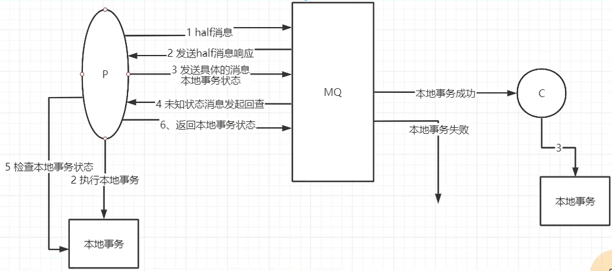
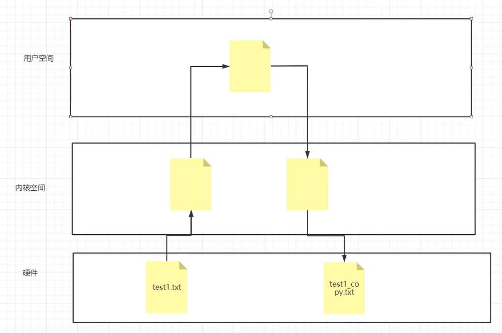
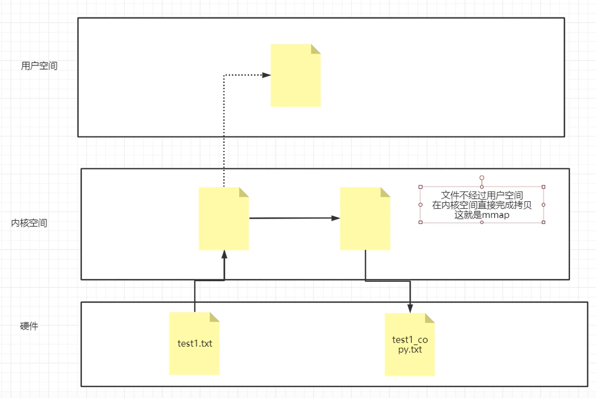
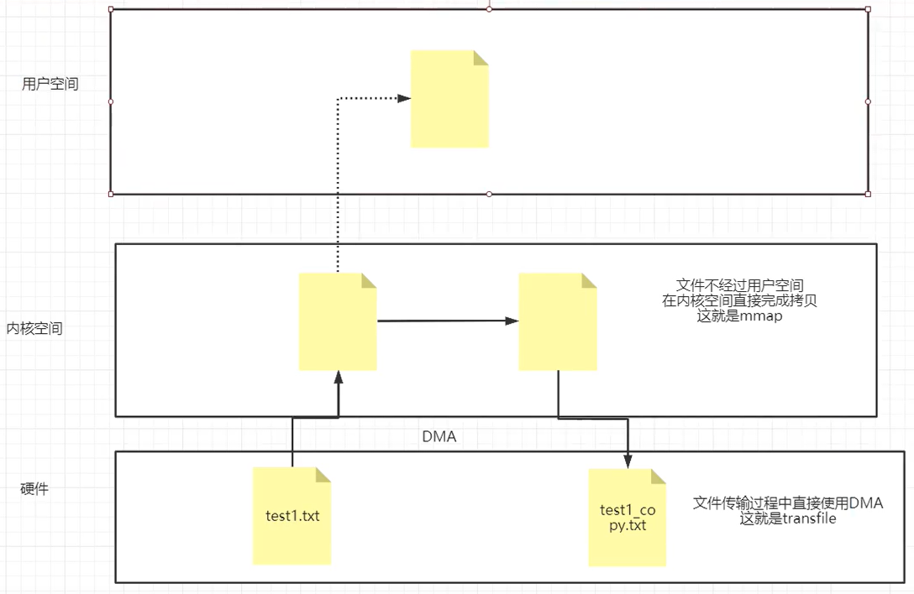

## Kafka, ActiveMQ, RabbitMQ, RocketMQ对比
ActiveMQ：JMS 规范，支持事务（ACID 特性）、支持 XA 协议，没有生产大规模支撑场景，官方维护越来越少。吞吐量单机都在万级以上。  
RabbitMQ：erlang 语言开发、性能好、高并发，支持多种语言，社区、文档方面有优势。  
erlang 语言不利于 java 程序员二次开发，依赖开源社区的维护和升级，需要学习 AMQP 协议，学习成本相对较高，吞吐量单机都在万级以上。  
kafka：高性能，高可用，生产环境有大规模使用场景，单机容量有限（一台机器上超过 64 个分区响应明显变长），社区更新慢，吞吐量单机百万。  
RocketMQ：java 实现，方便二次开发，设计参考了kafka，高可用、高可靠（可做到消息零丢失），社区活跃度一般，支持语言较少（JAVA、C++），吞吐量单机十万。  

## Kafka 的 pull 和 push
pull 表示消费者主动拉取，可以批量拉取，也可以单条拉取。同时可以设置不同的提交方式，实现不同的传输语义（至少一次、至多一次、精准一次）。  
所以 pull 可以由消费者自己控制，根据自己的消息处理能力来进行控制。  
但是消费者不能及时知道是否有消息，如果 kafka 没有数据，则会导致消费者空循环，浪费资源。  
解决：通过参数设置，可以让消费者拉取消息为空，或者没有达到一定的数量时，直接阻塞，释放 CPU 资源。    

push 表示 Broker 主动给消费者推送消息，所以肯定是有消息时才会推送，不会导致消费者空循环等待，但是消费者不能按自己的能力来消费消息。
推过来多少消息，消费者就得消费多少消息，所以可能会造成网络堵塞，消费者压力大等问题。  

## Kafka 的高性能、高吞吐原因
1. 磁盘顺序读写，使得磁盘读写效率接近内存。同时保证了消息的堆积能力，相对于 RabbitMQ 的读写内存，能堆积更多的消息。
2. 零拷贝技术。因为 kafka 并不需要处理数据，只需要接收再发送，因此可以使用零拷贝技术，跳过内核态和用户态之间的切换。
传统数据拷贝（涉及到内核态到用户态再到内核态的两次切换）：
   1. 磁盘上的数据拷贝到内核缓冲区
   2. 内核缓冲区中的数据拷贝到用户缓冲区，以便对数据进行一些处理
   3. 用户缓冲区中的数据拷贝到 Socket（也在内核中）的发送缓冲区
   4. 发送缓冲区中的数据发送到网卡，开始传输数据
零拷贝：
   1. 磁盘上的数据拷贝到内核缓冲区
   2. 内核缓冲区中的数据拷贝到 Socket（也在内核中）的发送缓冲区
   3. 发送缓冲区中的数据发送到网卡，开始传输数据
3. 分区分段 + 索引：kafka 的 message 消息实际上是分布式存储在一个一个小的 segment 中的，每次文件操作也是直接操作的 segment。
为了进一步优化查询，kafka 又默认为分段后的数据文件建立了索引文件，就是文件系统上的 .index 文件。
这种分区分段 + 索引的设计，不仅提升了数据读取的效率，同时也提高了数据操作的并行度
4. 批量压缩：多条消息一起压缩，然后发送，降低带宽占用。
5. 批量读写
6. 直接操作操作系统的 page cache，而不是 JVM 的内存，避免 GC、创建对象耗时。读写速度更高，同时进程重启，消息不会丢。
因为消息在 page cache 中，所以消息何时写入磁盘取决于操作系统何时刷盘。

## 使用 MQ 保证分布式事务的最终一致性
分布式事务：业务相关的多个操作，要保证同时成功或同时失败。
最终一致性：是一种弱一致性。是指在某个操作流程中，允许多个事务在某一段时间内不一致，但当整个操作完成时，这些事务的状态是一致的（都失败或都成功）。
强一致性：在整个操作流程中，多个事务在每一时刻的状态都是一致的。（分布式情况下几乎不可能）
MQ 要保护事务的最终一致性，需要做到：
1. 生产者要保证 100% 的消息投递。事务消息机制
2. 消费者要保证幂等消息。唯一 ID + 业务自己实现

## 分布式 MQ 三种语义
at least once（至少一次）：生产者、消费者需要确认消息是否发送、消费成功一次，最少保证成功了一次。  
at most once（至多一次）：生产者、消费者不确认消息是否发送、消费成功，发一次就完事，因此叫最多一次。  
exactly once（精确一次）：生产者、消费者确认消息已发送、消费成功，且保证只会成功一次。  
    RocketMQ：开源版本中，没有实现该语义，商业版本中，实现了。  
    KafKa：在新版本中，提供了该语义的 demo。但是否能用存疑。  
    RabbitMQ：没有实现该语义。  

## 消费者保证消息消费的幂等性
目的：防止消费者重复消费的问题。  
所有 MQ 产品都没有提供主动解决幂等性问题的机制，所以需要消费者业务程序自己实现。
1. RocketMQ 给每个消息分配了一个MessageID，可以作为判断消息幂等性的依据。但消息量过大时，RocketMQ 也无法保证该 MessageID 是唯一的。  
因此最好消费者再主动加一个业务 ID，联合起来做幂等判断。但其他消息中间件并没有实现该机制。所以不通用  
2. 通用：生成全局唯一 ID，然后放进 message 中，作为判断消息幂等性的依据。

## 如何保证高可靠，消息不丢失
### 哪些环节会造成消息丢失？
1. 生产者发送给 MQ，跨网络，可能丢
2. MQ 内部会将内存中的消息写入磁盘
3. MQ 内部主从节点同步
4. MQ 消费者消费消息时，可能丢
### 如何防止消息丢失？
#### 1. 生产者发送给 MQ 过程，如何保证不丢失  
kafka：消息发送及回调机制：生产者提供一个回调函数，并发出消息，MQ 接到消息后，调用回调函数，使生产者知晓消息已收到。否则重新发送。  
RocketMQ：也有消息发送及回调机制。还提供了事务消息机制。  
事务消息机制：事务和消息的状态是一致的。生产者本地事务成功，则对应消息推送给消费者，生产者本地事务失败，则对应消息被丢弃。  
   1. 生产者先向 MQ 发送 half 消息，只为了确认 MQ 是否存活
   2. MQ 响应 half 消息，则生产者开始执行本地事务。否则跳过事务执行其他应对逻辑
   3. 生产者产生消息，消息中携带了本地事务的状态，发送给 MQ
   4. MQ 检查消息中的事务状态，如为成功，则直接推送给消费者。如为失败，则消息被丢弃。如为未知，则进入第 5、6、7 步的循环
   5. MQ 会暂存事务状态为未知的消息，并隔段时间就向生产者发起该消息的事务状态回查请求
   6. 生产者接收到消息的事务状态回查请求，会检查本地事务的状态，并返回给 MQ
   7. MQ 判断事务状态，并根据第 4 步的机制决定对消息的处理。但当某消息的事务状态连续回查十五次均为未知，则 MQ 认为事务超时，将丢弃消息

事务消息机制常用于分布式事务回查的场景。比如网购订单的超时取消支付功能。订单给五分钟支付时间，超时则自动取消，时间内支付则成功。  
那么订单系统可以作为生产者，将订单入库，即本地事务。但发送给 MQ 时，主动将事务状态设为未知。等待 MQ 回查事务状态时，订单系统会请求支付系统。  
如该订单已支付，则返回事务成功；取消支付，则返回事务失败；待支付，则返回事务未知，直到支付系统发现支付记录已超时返回失败。  
RabbitMQ：也有消息发送及回调机制。还提供了手动事务机制、生产者确认机制。  
手动事务机制：在通道 channel 上提供了一组 API，将发送消息视作一个事务来处理，使生产者来控制发送消息事务的开始、提交、回滚动作。
但该机制会阻塞 channel，导致吞吐量下降。  
生产者确认机制：整个处理流程和 RocketMQ 的事务消息机制一样，但没有 RocketMQ 成熟，不好用。  
#### 2. MQ 内部会将内存中的消息写入磁盘 过程，如何保证不丢失
RocketMQ：配置集群的消息刷盘策略为 同步刷盘。  
1、异步刷盘，消息先进内存，后续写盘，效率高，可能丢消息  
2、同步刷盘，消息直接写盘，效率低，不丢消息  
RabbitMQ：将队列配置为持久化队列。  
#### 3. MQ 内部主从节点同步 过程，如何保证不丢失
RocketMQ：普通集群配置主从同步同步策略，或者直接搭建 Dledger 集群。  
1、普通集群（主从角色一经首次确定则固定下来）中，  
存在 主从同步同步（生产者 -> 主 -> 从 -> 生产者。即生产者会等待从节点返回消息收到的响应，没有响应则会再次发送消息）、  
主从异步同步（生产者 -> 主 -> 从。即生产者不会等待从节点返回消息收到的响应，只等待主节点返回消息收到的响应。无法保证主从节点之间一定同步成功）   
两种主从同步策略可配。异步同步效率高，但可能丢失消息，同步同步不会丢失消息。  
2、Dledger 集群（主从角色不固定，节点角色无差别，在生产者请求发送消息时，才会动态选举得出本次接收响应的主、从节点）中，  
生产者 -> 主 -> 从，主节点在接收消息后，将该消息状态置为 uncommited，并返回给生产者消息收到的响应。在异步向所有从节点同步消息，  
在大多数从节点返回消息收到的响应后，主节点会将消息的状态置为 commited，并停止同步。所以 Dledger 集群一定不小于三个节点。
RabbitMQ：搭建镜像集群。  
1、普通集群中，消息不会在集群中的节点之间同步，也就是说如果某个节点挂了，那它存储的消息也丢失了，集群中其他节点是没有它所拥有的消息的。  
当消费者请求普通集群中的某个节点时，如果它所需要的消息不在本节点上，会先将消息先拷贝到当前节点，然后返回给消费者。  
2、镜像集群中，节点之间会主动进行消息同步。数据安全性较高。  
Kafka：配置集群的 acks，0、1、all。  
#### 4. MQ 消费者消费消息 过程，如何保证不丢失  
RocketMQ：消费者使用默认的方式消费就行，不要采用异步消费方式。默认是同步消费的策略，会等待消费者的消息处理事务成功后，才更新 offset  
RabbitMQ：消费者关闭自动提交 autoCommit。在本地消息处理事务成功后，手动提交 offset。  
Kafka：消费者手动提交 offset。在本地消息处理事务成功后，手动提交 offset。    

## MQ 如何保证消息高速读写？
Kafka 和 RocketMQ 会使用零拷贝技术，RocketMQ 使用 mmap 方式进行文件读写，比如它的 commitlog 每次固定 1G。
Kafka 的 index 日志文件是通过 mmap 方式进行读写的，但其他文件却并没有使用零拷贝技术。而 Kafka 会使用 transfile 方式将硬盘数据加载到网卡。  

未使用零拷贝技术时，如果程序需要操作硬件数据，会经历四次拷贝，即图中的四个箭头。   
要操作硬件中的数据，首先要从硬件中把它取出来，硬件 -> 内核空间、内核空间 -> 用户空间。  
在用户空间中对数据做了一些特殊处理后，又要将其写入硬件，用户空间 -> 内核空间、内核空间 -> 硬件。  

零拷贝技术有两种实现方式：mmap 和 transfile。可将四次拷贝减少为三次，即图中的三个实线箭头。  
mmap：只将内核空间中数据的一部分映射到用户空间，用户空间中的程序对该部分进行修改。
修改完成后，直接在内核空间中拷贝一份，并根据修改后的映射来修改拷贝，然后写入硬件中。

transfile：操作系统在内存中开辟一个 DMA 区域，该区域允许不同的硬件使用同一处内存。常见的是：从磁盘中读取数据并通过网卡发送。
如果 transfile 技术，那么只需要将数据从磁盘中拷贝到 DMA，然后网卡可以直接从 DMA 读取数据并发送出去。
如果不使用 transfile 技术，那么需要将数据从磁盘中拷贝到内核空间中属于磁盘的空间，然后再拷贝到属于网卡的空间，最后网卡从自己的空间读取数据。

Java 对零拷贝技术进行了封装，mmap 方式通过 MappedByteBuffer 对象进行操作，transfile 通过 FileChannel 对象进行操作。  
mmap 方式适合操作比较小的文件，大小范围最好在 1.5G - 2G。transfile 无文件大小范围限制，但内存始终有限。
