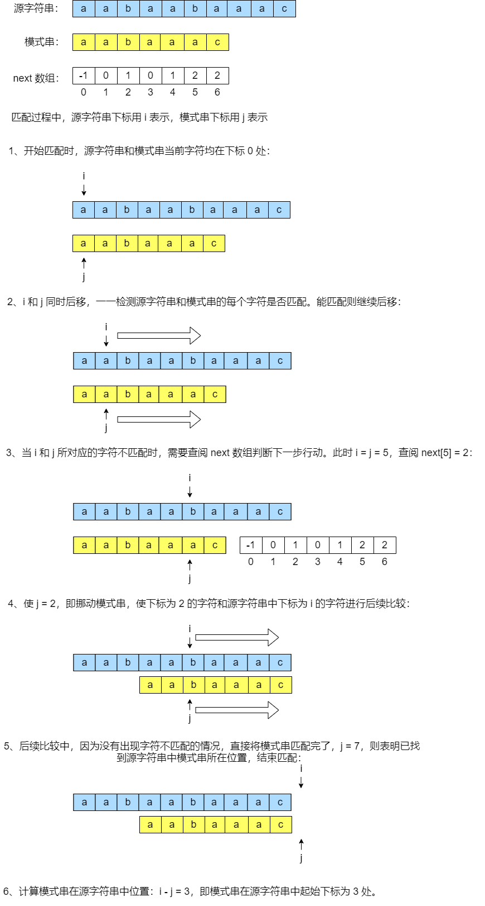
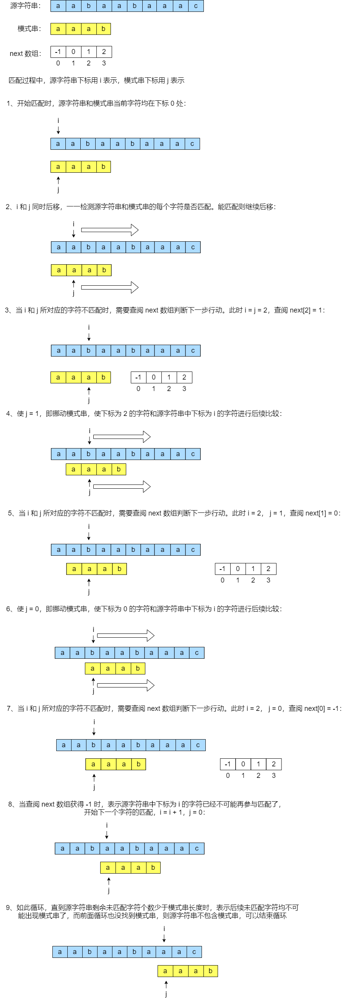
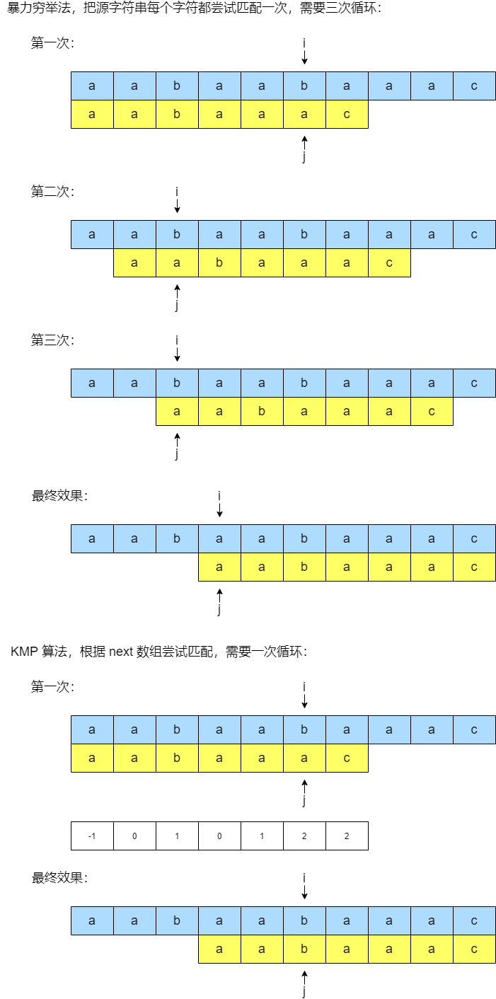
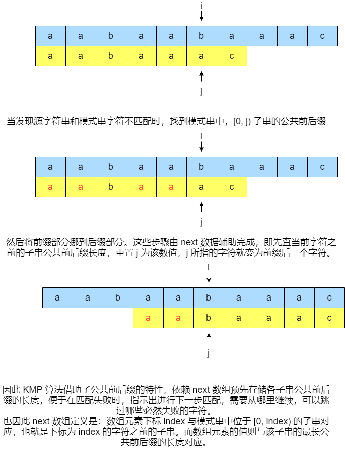
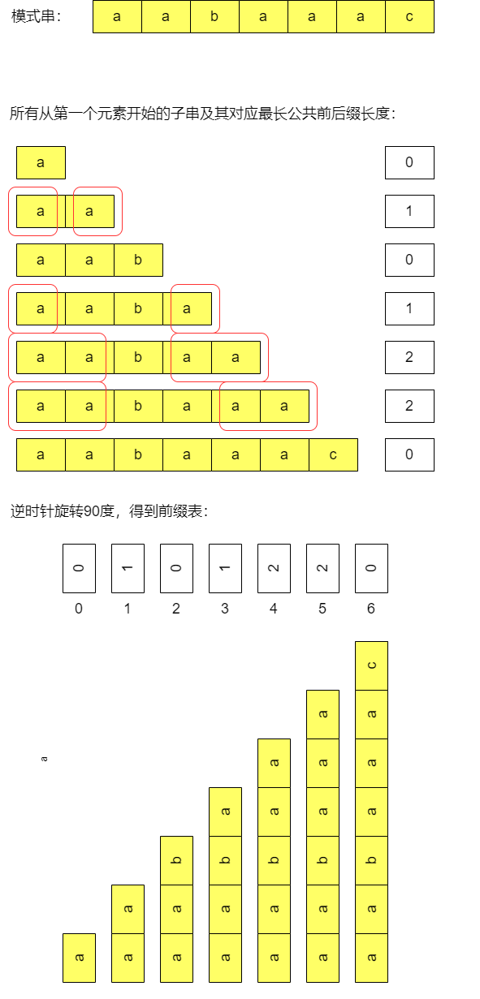
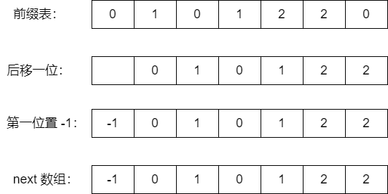

# 说明
KMP 算法是求一个模式串（pattern）在某个指定字符串中出现位置的通用方法。作用类似 indexOf()。  
返回指定字符在字符串中第一次出现处的索引，如果此字符串中没有这样的字符，则返回 -1。  
它的名字是由三位提出者的姓名首字母拼成的。  
KMP 算法最核心的点就是：先求出模式串的前缀表，根据前缀表生成 next 数组，最后根据 next 数组改变在匹配指定字符串时的行为。  

但对于如何求 KMP 的 next 数组，很多人都不清楚。当然我也是，又不想背代码模板，公认的求 next 数组的代码逻辑又没琢磨明白，  
主要是找了一堆文章，要么直接给出代码而不进行讲解，要么模棱两可，要么就直接说就该是那几个步骤，至于为什么是这些步骤，估计真正吃透的人不多。  
要么就是真正吃透的人洋洋洒洒一长篇说明，结果还是看晕了。总之我就决定自己研究出如何求 next 数组，真正地学会 KMP 算法。

# 前置知识
## 最长公共前后缀
1. 前缀：从字符串的第一个字符开始，与其后的连续字符所形成的所有子串（不包含该字符串本身），都叫该字符串的前缀。  
即：abcd 的 前缀有三个：a，ab，abc。一定包含第一个字符，一定不包含字符串本身。  
2. 后缀：从字符串的最后一个字符开始，与其前的连续字符所形成的所有子串（不包含该字符串本身），都叫该字符串的后缀。  
即：abcd 的 前缀有三个：d，cd，bcd。一定包含最后一个字符，一定不包含字符串本身。  
3. 公共前后缀：某个前缀和某个后缀相同时，称该前（后）缀为公共前后缀。  
即：abab 有前缀三个：a，ab，aba，有后缀三个：b，ab，bab，有公共前后缀一个：ab。  
4. 最长公共前后缀：公共前后缀中，最长的那个。

## next 数组的定义
我们要用 KMP 算法，首先要在自己心中对于 next 数组有清晰的定义。就好像要用乘法口诀首先得明白乘号的定义一样。  
在查阅资料过程中，我发现 next 数组的定义并不统一，我理解了其中一种。  
即：next 数组是存储了**在对指定字符串和模式串做字符匹配的过程中，发生了字符不匹配的情况时，所需要执行的下一步操作**的数组。
next 数组就是一个普通的整型数组，  
它的元素的下标表示**在模式串中，处于该下标之前的字符所组成的字符串的最长公共前后缀**，  
它的元素的值表示**该下标所表示的最长公共前后缀的长度**。  

比如：abac 的 next 数组为：[-1, 0, 0, 1]  
对于下标为 0 的元素，其含义为：abac 中下标范围为 [0, 0) 的子串，其最长公共前后缀长度为 -1。（因不存在下标在 [0, 0) 的子串，所以为特殊值 -1）。  
对于下标为 1 的元素，其含义为：abac 中下标范围为 [0, 1) 的子串，即 a，其最长公共前后组长度为 0。  
对于下标为 2 的元素，其含义为：abac 中下标范围为 [0, 2) 的子串，即 ab，其最长公共前后组长度为 0。  
对于下标为 3 的元素，其含义为：abac 中下标范围为 [0, 3) 的子串，即 aba，其最长公共前后组长度为 1。

## next 数组的用法
为什么要有 next 数组？为什么 next 的数组是这么定义的？这都取决于 next 的数组需要发挥什么作用。  
KMP 算法之所以比暴力匹配法来的快，在于它通过 next 数组存储了模式串中已经匹配成功的部分，从而避免了重复匹配那些已确定可以匹配上的字符，提高效率。  
在 KMP 算法中，next 数组的元素还有另一层含义：**如果匹配到某个下标的字符时，发现匹配失败，则挪动模式串，
使得该下标所指 next 数组元素的值为下标的字符，与源字符串当前字符对齐，并开始新一轮匹配。  
特别地：next 数组第一个元素恒为 -1，它的含义则是，将模式串第一个字符与源字符串下一个字符对齐，并开始后续匹配。**  
看一个可匹配成功的示例：  
我们想在源字符串 aabaabaaac 中，使用 KMP 算法找到模式串 aabaaac 出现的位置  
1. 首先根据模式串构建 next 数组为：[-1, 0, 1, 0, 1, 2, 2]
2. 开始逐个匹配源字符串和模式串的字符，可以看见会在源字符串和模式串下标为 5 的字符处出现差异：  
aabaabaaac  
aabaaac  
此时查阅 next 数组，发现下标为 5 的元素值为 2。则表示：需要挪动模式串，使得下标为 2 的字符，与源字符串当前（下标为 5）字符对齐，然后再继续匹配。
3. 在后续匹配中，没有发现不匹配的地方了，模式串全部匹配完毕，表示已找到符合模式串的子串，其位置为：当前下标 - 模式串长度  

示意图：  
  
再看一个匹配失败的示例：  
我们想在字符串 aabaabaaac 中，使用 KMP 算法找到模式串 aaad 出现的位置  
1. 首先根据模式串构建 next 数组为：[-1, 0, 1, 2]
2. 开始逐个匹配源字符串和模式串的字符，可以看见会在源字符串和模式串下标为 2 的字符处出现差异：  
   aabaabaaac  
   aaad  
   此时查阅 next 数组，发现下标为 2 的元素值为 1。则表示：需要挪动模式串，使得下标为 1 的字符，与源字符串当前（下标为 2）字符对齐，然后再继续匹配。
3. 但模式串中下标为 1 的字符，和源字符串中下标为 2 的字符依旧不匹配，则再次查阅 next 数组，发现下标为 1 的元素，值为 0。  
则表示：需要挪动模式串，使得下标为 0 的字符和源字符串下标为 2 的字符对齐，并做后续匹配。  
4. 但模式串中下标为 0 的字符，和源字符串中下标为 2 的字符依旧不匹配，则再次查阅 next 数组，发现下标为 0 的元素，值为 -1。  
则表示：需要挪动模式串，使得下标为 0 的字符和源字符串下标为 2 + 1 = 3 的字符对齐，并做后续匹配。

示意图：  
  

### KMP 算法运行原理
为什么可以通过 next 数组指导 KMP 算法的行为？为什么按照 next 数组的操作来走，就能正确地找到子串的位置？  
我们结合前文介绍的 next 数组的定义和用例来理解 KMP 算法的设计思路。  
首先，在源字符串 aabaabaaac 中寻找 aabaaac 模式串的示例中，当我们比较到源字符串和模式串的下标为 5 (i = j = 5) 的字符时，会出现第一次不匹配的情况。  
于是查阅 next 数组下标为 5 (因为 j = 5) 的元素，得知其值为 2，所以我们明白下一步需要将模式串中下标为 2 (j 重置为 2) 的字符与源字符串中下标为 5 (i = 5) 的字符对齐做匹配。  
详解：当我们试图匹配源字符串和模式串下标为 5 (i = j = 5) 的字符时，可以保证的是，源字符串和模式串中，下标为 0 到 4 (范围：[i - j, i)) 的字符是完全相等的，因为之前的匹配步骤已经匹配过它们。  
可是此时我们发现源字符串和模式串该位置(i = j = 5)字符并不匹配，表示源字符串中 i = [0, 5] 范围所形成的子串和模式串中 j = [0, 5] 范围所形成的子串已经匹配失败，需要寻找下一个子串来与模式串进行匹配。  
如果是暴力穷举算法来找新子串，它会使 i 递增 1，把源字符串的每一个字符，一个一个地当做子串的起始位置，然后试图去与模式串进行匹配。
而 KMP 算法则依靠 next 数组来寻找子串，它会把模式串挪动，使模式串下标为 next 数组元素值的字符，与源字符串当前字符对齐，再试图匹配。  
要达到相同的效果，暴力穷举法需要经过 3 次循环，而 KMP 算法只需经过 1 次循环。

可以看到 KMP 算法能跳过一些错误路径，直接到达下一步可能正确的位置，实现这一行为靠的就是公共前后缀。  
当发现一个字符不匹配时，只需要找到模式串中，在它之前的字符所形成的字符串的公共前后缀，然后将前缀部分挪到后缀部分即可。  

# next 数组的求法
这是我自己研究出来的 next 数组求法，反正许多文章讲解的逻辑我都没摸透，总有一两个关键点含糊其辞，然后弄得无法继续理解。  
不知道是我自己糊还是作者糊，总之肯定得有一个是糊的。  
说说我的思路：
1. 先求前缀表
2. 前缀表所有元素后移一位，最后一位丢弃不管，然后在第一位填入固定值 -1

## 先求前缀表
前缀表：前缀表也是数组，可以看见 next 数组由它衍生而来，因此定义十分相近。它表示所有从第一个字符开始的各个子串的最长公共前后缀的长度。  
前缀表的元素下标表示一个从第一个字符开始的子串，前缀表的元素值表示该子串的最长公共前后缀的长度。

## 衍生 next 数组
前缀表所有元素后移一位，最后一位丢弃不管，然后在第一位填入固定值 -1

